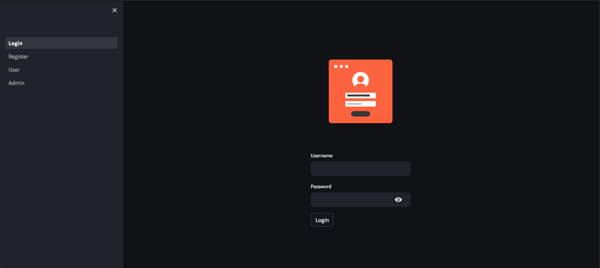
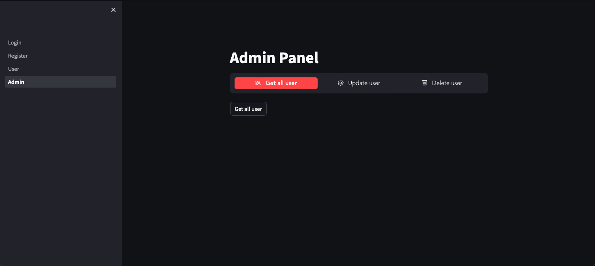

# Employee Management Application

  
  

The Employee Management Application is a web application built using FastAPI and Streamlit. It is designed to make employee management easy and efficient. The application provides a simple user interface for managing employee data.

## Application Structure

The application consists of frontend and backend components.

### Frontend

The frontend of the application is built using Streamlit and includes the following modules:

- **Login.py**: Handles user login functionality.
- **Register.py**: Provides user registration functionality.
- **User.py**: Defines the user interface and operations for standard users.
- **Admin.py**: Defines the interface and operations for admin users.

### Backend

The backend of the application is built using FastAPI and includes the following modules:

- **main.py**: The entry point for the FastAPI application, where routes are defined.
- **database.py**: Handles the connection to the SQLite database.
- **models.py**: Defines the SQLAlchemy models for the application.
- **users.py**: Contains operations related to user data.
- **admin.py**: Contains operations related to admin data.
- **auth.py**: Handles authentication operations.

## Database

The application uses a SQLite database for persistent storage. The database file is `employee_app.db`.

## Installation & Usage

1. Clone the repository.
2. Create a virtual environment using `python -m venv venv`.
3. Activate the virtual environment using `source venv/bin/activate`.
4. Install the dependencies by running `pip install -r requirements.txt`.
5. Run the FastAPI server using `uvicorn main:app --reload` (make sure to run this in the Employee-App-BE directory).
6. Run the Streamlit frontend using `streamlit run 1_Login.py` (make sure to run this in the Employee-App-FE directory).

## Use Cases

Here are some potential use cases for the Employee Management Application:

1. **User Registration**: A new user can register to the system. The registration data is processed and stored in the SQLite database.
2. **User Login**: An existing user can log in to the system. The backend verifies the user credentials.
3. **User Profile Management**: After logging in, a user can view and manage their profile information.
4. **Admin User Management**: An admin can manage user profiles, including viewing, creating, updating, and deleting user profiles.
5. **Admin Login**: An admin can log in to the system, similar to a standard user, but they have additional capabilities.
6. **Admin Registration**: A new admin can register to the system, similar to a standard user registration.

## Future Work
- Add unit tests for the appilcation.
- Add integration tests for the application with Postman.
- Add E2E tests for the application with Cypress or Playwright.
- Add CI/CD pipeline for the application.